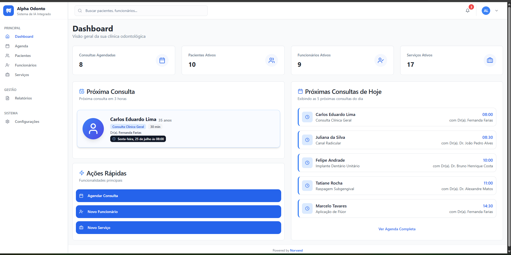

# Rastreador de Automação Clínica



## Sobre o Projeto
O Rastreador de Automação Clínica é um painel web desenvolvido pela Norvand Tecnologia Ltda para clínicas odontológicas acompanharem, em tempo real, as ações e resultados de automações de IA personalizadas criadas sob demanda. O sistema integra-se ao agente de IA do cliente, permitindo total transparência e acompanhamento das atividades automatizadas.

## Público-alvo
- Clínicas odontológicas que utilizam soluções de automação e IA desenvolvidas pela Norvand.

## Funcionalidades Principais
- **Dashboard** com estatísticas e indicadores em tempo real
- **Agenda inteligente**: visualização, busca e gerenciamento de consultas
- **Cadastro e gestão de pacientes**
- **Gestão de funcionários e equipe**
- **Busca global/autocomplete** (pacientes, funcionários, consultas)
- **Visualização de logs e ações da IA**
- **Interface responsiva e moderna**

## Tecnologias & Destaques
- React 18 + TypeScript
- Vite
- TailwindCSS + shadcn/ui
- Radix UI (componentes acessíveis)
- React Router DOM
- React Query
- Lucide Icons
- Charts (Recharts)
- Estrutura modular e escalável

## Como rodar localmente
```bash
# Instale as dependências
npm install
# ou
bun install

# Rode o projeto em modo desenvolvimento
npm run dev
# ou
bun run dev
```
Acesse: http://localhost:8080

> **Atenção:** O sistema é exclusivo para clientes Norvand. O acesso à produção é restrito e não há versão pública.

## Screenshots
Veja exemplos em `src/assets/previews`.

## Licença e Uso
Este projeto é propriedade exclusiva da Norvand Tecnologia Ltda. **É proibido o uso, cópia ou redistribuição, seja para fins pessoais ou comerciais.**

## Contato
- E-mail: contato@norvand.com
- WhatsApp: +55 (11) 91548-0518
- CNPJ: 61.428.864/0001-59

---
Norvand Tecnologia Ltda